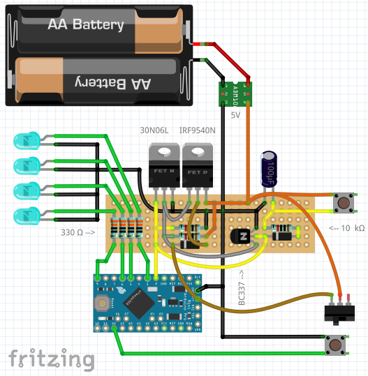

# Arduino Butterfly Lamp

"Upgrade" your Ikea Upplyst butterfly lamp to a more active LED lamp using an Arduino. Ofcourse all at your own risk, no permission was given by the product's manufacturer. As described in other projects, I am not a professional programmer or have any education in electronics, so some own improvements may be in order.

##### YouTube:

#### Requirements:
* 1x Arduino Pro Mini ATMega 328p 5V
* 1x 1V-5V to 5V DC-DC Step-Up Power booster
* 6x LED (blue)
* 6x Resistor 330Ω
* 3x Resistor 10KΩ
* 2x Diode
* 1x 100µF Capacitor
* 1x MOSFET N-Channel (30N06L)
* 1x MOSFET P-Channel (IRF9540)
* 1x Transistor (BC337)
* 2x Toggle Switch
* 1x Micro Switch
* 1x Battery case - 2slot AA
* Programming board for the Arduino Pro Mini *(*1)*
* Soldering equipment
* Wires
* Glue
* 3D printer (optional)

**1: There are several solutions, like using another arduino with an USB interface like the R3 or Nano, or use an interface like the CP2102 wich I preferred (don't forget to also order your dupont cables)*

#### Circuit:
